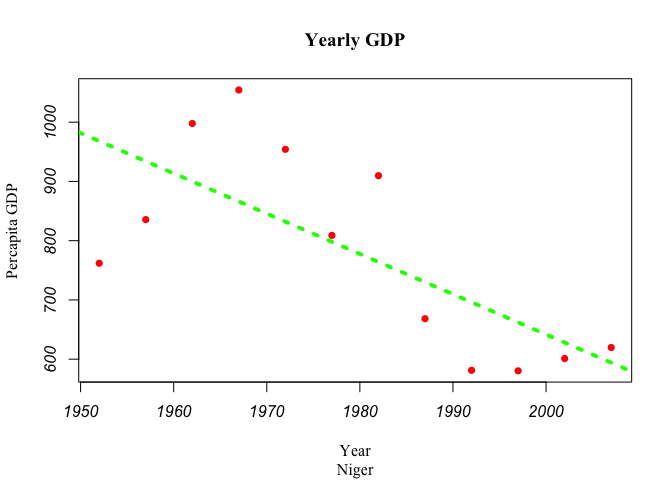
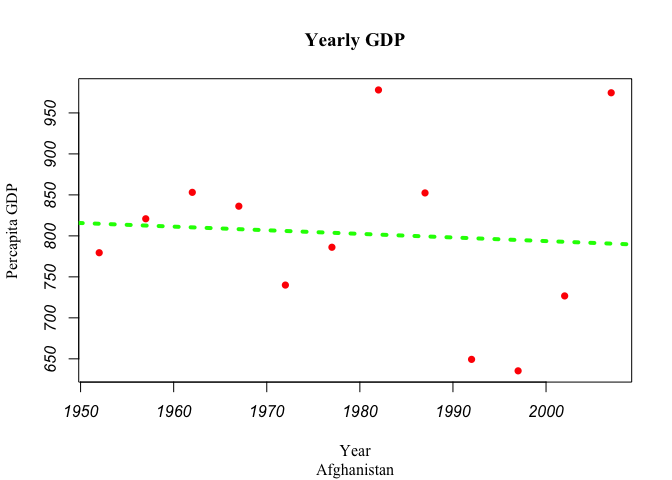
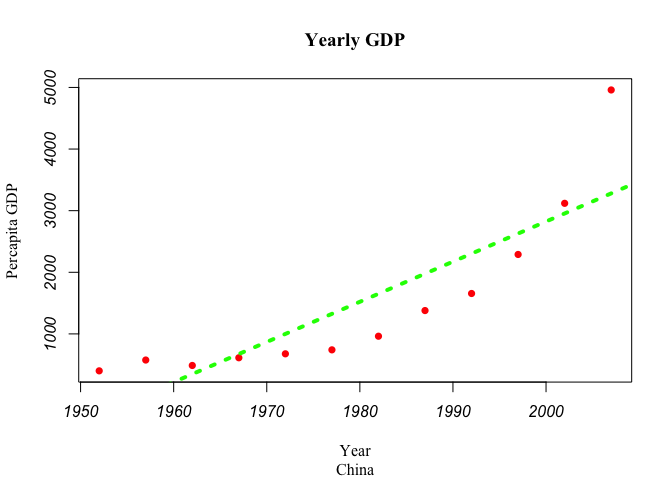

# Untitled
Ashley Lawrence  
October 4, 2015  

This is an R Markdown document. Markdown is a simple formatting syntax for authoring HTML, PDF, and MS Word documents. For more details on using R Markdown see <http://rmarkdown.rstudio.com>.

When you click the **Knit** button a document will be generated that includes both content as well as the output of any embedded R code chunks within the document. You can embed an R code chunk like this:


You can also embed plots, for example:

   

China's GDP seems to be increasing exponentially whereas Niger and Afghanistan's GDP are decreasing. Niger's GDP is decreasing more dramatically than Afghanistan's GDP. 

Life Expectancy by Country

```
##       country    min    max     mean
## 1       Niger 37.444 56.867 44.55867
## 2 Afghanistan 28.801 43.828 37.47883
## 3       China 44.000 72.961 61.78514
```

China has the highest life expectancy of the three countries. 
